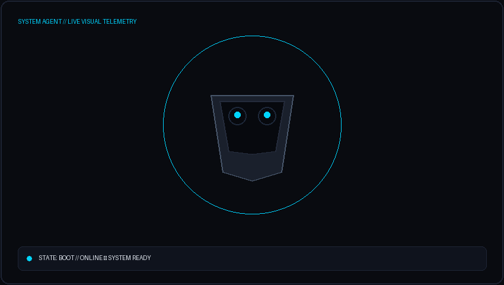
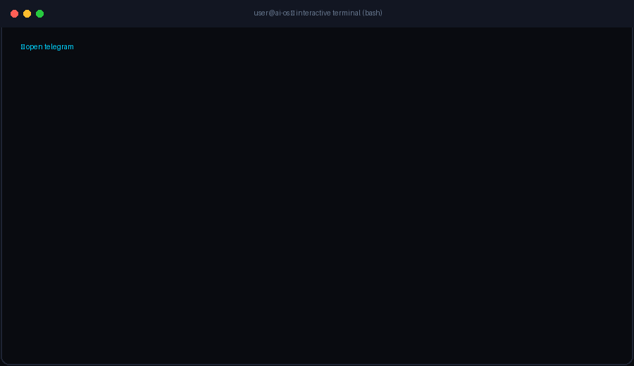
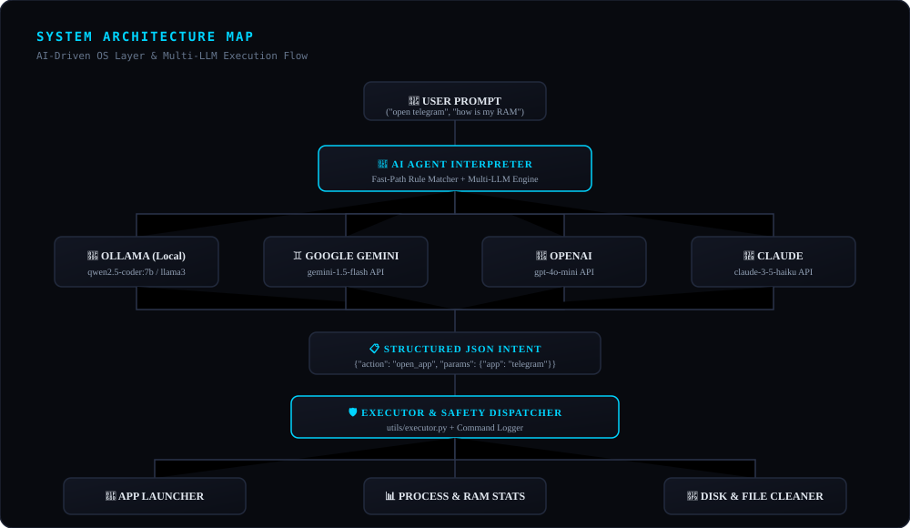

<p align="center">
  
</p>

<p align="center">
  
</p>

<div align="center">

```
AI ENGINE       MULTI-LLM (OLLAMA / GEMINI / OPENAI / CLAUDE)
EXECUTION       WINDOWS OS KERNEL & APPLICATION LAUNCHER
LATENCY         0.0 MS (FAST-PATH REASONING)
INTERFACE       WEB DASHBOARD + TERMINAL BASH CLI
MONITORING      AUTONOMOUS HEALTH ENGINE (REAL-TIME)
STATUS          PROTOTYPE / ACTIVE DEVELOPMENT
```

</div>

---

## 📋 Overview

**AI-OS** is an intelligent operating-system research prototype that acts as a natural language translation layer between human intent and local PC operations.

Instead of navigating deep menus or writing complex shell scripts, users interact with **AI-OS** using natural language prompts. The system interprets intention, constructs a validated execution plan, and interacts directly with the local Windows environment.

```
PROMPT  ➔  UNDERSTAND  ➔  INTERPRET  ➔  VALIDATE  ➔  EXECUTE  ➔  LOG
```

---

## 🖥️ Live Terminal Demonstration

<p align="center">
  
</p>

---

## 🏗️ Architecture & Processing Flow

<p align="center">
  
</p>

---

## ⚡ Core Capabilities

### 1. 🚀 Real Application Launcher
Launches local desktop applications instantly on your PC using smart binary path resolution:
- `open telegram` ➔ Launches Telegram Desktop app
- `open visual studio code` ➔ Opens VS Code editor
- `open chrome` / `open edge` ➔ Opens browser
- `open file explorer` ➔ Opens Windows File Explorer
- `open notepad` / `open calc` ➔ Launches system tools

### 2. 🤖 Multi-Provider LLM Prompt Engine
- **Local Ollama** (Free local LLM, zero API key required — defaults to `qwen2.5-coder:7b` / `llama3`).
- **Google Gemini API** (`gemini-1.5-flash`).
- **OpenAI API** (`gpt-4o-mini`).
- **Anthropic Claude API** (`claude-3-5-haiku`).
- **0ms Fast-Path Execution Engine**: Instantly resolves unambiguous OS commands in <1ms without network overhead.

### 3. 📊 Live System Telemetry & Process Management
- **CPU Stats**: Live usage, core counts, and frequency (non-blocking monitoring).
- **RAM Telemetry**: Memory usage breakdown (Used / Available / Swap).
- **Disk Analysis**: Multi-drive storage metrics & partition usage.
- **Process Manager**: CPU-sorted process inspection & safety-locked process termination.

### 4. ⚡ Autonomous Health Monitor & Adaptive Learner
- Runs a background thread monitoring system thresholds (CPU > 80%, RAM > 80%, Disk > 90%).
- Proactively generates alerts and recommendations based on command frequency.

---

## 🛡️ Security & Execution Pipeline

Because **AI-OS** interfaces with your local operating system, security presentation and execution scoping are strictly enforced:

```
[ USER PROMPT ] ➔ "kill process 4589"
       │
       ▼
[ LLM INTERPRETER ] ➔ Action: kill_process | PID: 4589
       │
       ▼
[ SAFETY LAYER ] ➔ Check PID against PROTECTED_NAMES (systemd, kernel, python, etc.)
       │
       ├─► Protected Process  ➔ 🔒 DENIED ("System safety lock engaged")
       └─► Safe Process       ➔ ✅ APPROVED & EXECUTED
```

> [!IMPORTANT]
> - **Process Termination**: Critical kernel and system-level processes are protected by a safety lock filter.
> - **Confirmation Mode (Roadmap)**: An explicit user prompt confirmation step for elevated commands is currently planned for future releases.

---

## ⚙️ Quick Start & Installation

### 1. Clone the Repository
```bash
git clone https://github.com/YOUR_USERNAME/ai_os_project.git
cd ai_os_project
```

### 2. Set Up Environment
* **PowerShell**:
  ```powershell
  python -m venv venv
  .\venv\Scripts\activate
  ```
* **Linux / macOS**:
  ```bash
  python3 -m venv venv
  source venv/bin/activate
  ```

### 3. Install Dependencies
```bash
pip install -r requirements.txt
```

### 4. Configure Environment (`.env`)
Copy `.env.example` to create your local `.env`:
```bash
cp .env.example .env
```

To use **Local Ollama** (Free, no API key needed):
```env
LLM_PROVIDER=ollama
OLLAMA_HOST=http://localhost:11434
OLLAMA_MODEL=qwen2.5-coder:7b
```

---

## 🚀 Running AI-OS

### Interface A: Web Dashboard (Recommended) 🌐
```bash
python app.py
```
Open your web browser at: **[http://localhost:5000](http://localhost:5000)**

### Interface B: Terminal CLI 💻
```bash
python cli.py
```

---

## 🗂️ Project Structure

```
ai_os_project/
│
├── app.py                  # Flask web application & API endpoints
├── cli.py                  # Terminal CLI interface
├── requirements.txt        # Python dependencies
├── .env.example            # Environment variables configuration template
├── .gitignore              # Git ignore rules (.env, venv, cache)
│
├── assets/                 # GitHub presentation & animation assets
│   ├── ai-os-banner.svg    # Hero banner asset
│   ├── ai-assistant.gif    # 3D AI Assistant state animation
│   ├── terminal-demo.gif   # Interactive terminal demonstration
│   └── architecture.svg    # System architecture map
│
├── scripts/
│   └── generate_assets.py  # Visual asset generator script
│
├── agent/
│   ├── llm_agent.py        # Multi-provider LLM prompt interpreter
│   ├── interpreter.py      # Fast-path rule matcher
│   ├── monitor.py          # Background system health monitor
│   └── learner.py          # Adaptive usage learner
│
├── os_sim/
│   ├── process_manager.py  # Real app launcher & process stats
│   ├── memory_manager.py   # Memory analytics & optimization
│   └── file_manager.py     # Disk statistics & temp cleanup
│
├── utils/
│   ├── executor.py         # Command dispatcher
│   └── logger.py           # Execution logging
│
└── templates/
    └── index.html          # Web UI Dashboard
```

---

## 🔮 Roadmap

- [x] Multi-Provider LLM Support (Ollama, Gemini, OpenAI, Claude)
- [x] Fast-Path Execution Pipeline (<1ms latency)
- [x] Real Local Application Launcher (Telegram, VS Code, Chrome, etc.)
- [ ] Explicit User Confirmation Modal for Destructive Operations `[PLANNED]`
- [ ] Voice Command Input & Speech Synthesis `[PLANNED]`
- [ ] Multi-Agent Task Automation Sequences `[PLANNED]`

---

## 👨‍💻 Author & License

**AI-Driven Intelligent OS — Prototype Project**  
Licensed under the MIT License.
